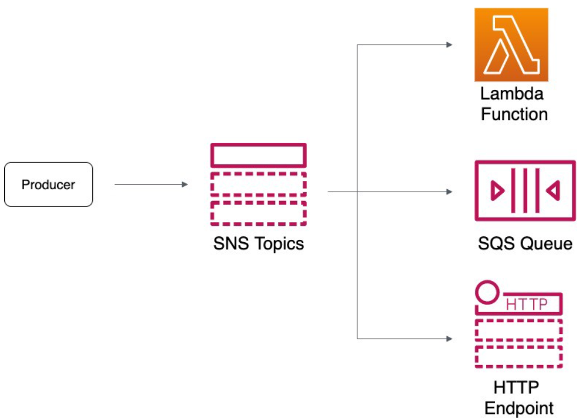
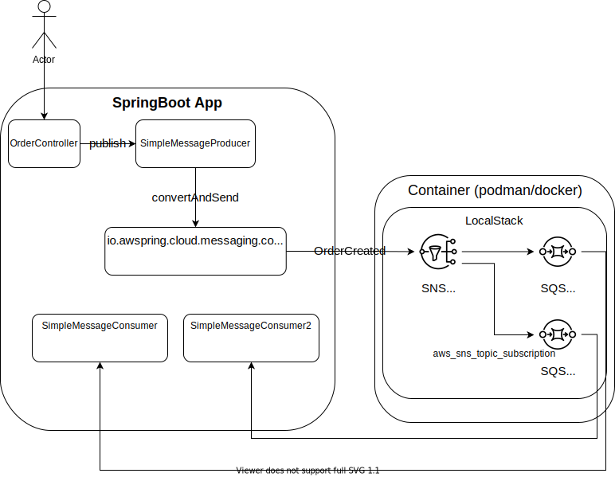

# Spring Cloud Messaging With AWS and LocalStack

Based on <https://auth0.com/blog/spring-cloud-messaging-with-aws-and-localstack/>

## AWS SQS SNS




## Running localstack

```bash
// run localstack
podman run --rm -it -p 4566:4566 -p 4571:4571 localstack/localstack

// to use network host
podman run --rm -it -p 4566:4566 -p 4571:4571 --network host localstack/localstack

//check
curl http://localhost:4566/health | jq
```

## Terraform with local stack

<https://registry.terraform.io/providers/hashicorp/aws/latest/docs/guides/custom-service-endpoints#localstack>

<https://docs.localstack.cloud/integrations/terraform/>

<https://dev.to/mrwormhole/localstack-with-terraform-and-docker-for-running-aws-locally-3a6d>

```bash
cd infra-as-code
terraform init
terraform validate
terraform plan
terraform apply -auto-approve

aws --endpoint-url=http://localhost:4566 sqs list-queues
aws --endpoint-url=http://localhost:4566 sns list-subscriptions

```

```bash
mvn spring-boot:run
curl http://localhost:8080/create-order

aws --endpoint=http://localhost:4566 logs describe-log-groups
aws --endpoint=http://localhost:4566 logs describe-log-streams --log-group-name sns/ca-central-1/000000000000/order-created-topic
aws --endpoint=http://localhost:4566 logs get-log-events --log-group-name sns/ca-central-1/000000000000/order-created-topic --log-stream-name 'bc9f4387-16e9-448d-8e61-2b094621e9cd'
```

## to still investigate

<https://github.com/localstack/localstack-java-utils>